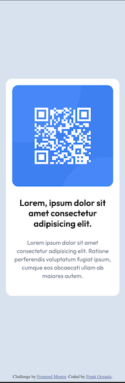

# Frontend Mentor - QR code component solution

This is a solution to the [QR code component challenge on Frontend Mentor](https://www.frontendmentor.io/challenges/qr-code-component-iux_sIO_H). Frontend Mentor challenges help you improve your coding skills by building realistic projects.

## Table of contents

- [Overview](#overview)
  - [Screenshot](#screenshot)
  - [Links](#links)
- [My process](#my-process)
  - [Built with](#built-with)
  - [What I learned](#what-i-learned)
- [Author](#author)
- [Acknowledgments](#acknowledgments)

## Overview

### Screenshot




### Links

- Solution URL: [Add solution URL here](https://your-solution-url.com)
- Live Site URL: [Add live site URL here](https://your-live-site-url.com)

## My process

### Built with

- Semantic HTML5 markup
- CSS custom properties
- Flexbox
- Mobile-first workflow

### What I learned

To see how you can add code snippets, see below:

```html
<div class="card">
  <div class="img-wrapper">
    
  </div>
</div>
```

```css
.card {
  max-width: 320px;
  background-color: var(--color-white);
  padding: var(--spacing-small) var(--spacing-small) var(--spacing-large) var(
      --spacing-small
    );
  border-radius: 15px;
  text-align: center;
}

.img-wrapper img {
  max-width: 100%;
  height: 100%;

  object-fit: contain;
  border-radius: 15px;
}
```

## Author

- Frontend Mentor - [@yourusername](https://www.frontendmentor.io/profile/@looonnng)

## Acknowledgments

Thanks Frontend Mentor for providing this free exercise
